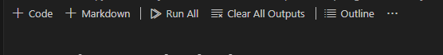

# Python Data Structures and Notebooks

## Title: webmin-02-project

 Name: Anjana Dhakal, Date: 10/25/2024

Objectives: This exercise is used to reinforce key Python concepts including data structures, functions, and more. It offers practice with web-enabled Jupyter notebooks and lays some important foundations for web mining. 

## Copy and clone base repository 

1. Copy the base repository into your GitHub account by selecting the "Use this Template" button on GitHub and specifying yourself as the owner.  
The base repository is available at:
 https://github.com/wmnlp-materials/python-ds-nb/blob/main/python-ds.ipynbLinks 
 
to an external site.

2. On your machine, clone YOUR new repo down to your machine.

## Export to HTML
Export Using Jupyter Menu

I used more options (...) tap near outline in the home page of Jupyter Notebook and export as HTML.


## Git add and commit
```
git add .
git commit -m "start a project"
git push origin main
```